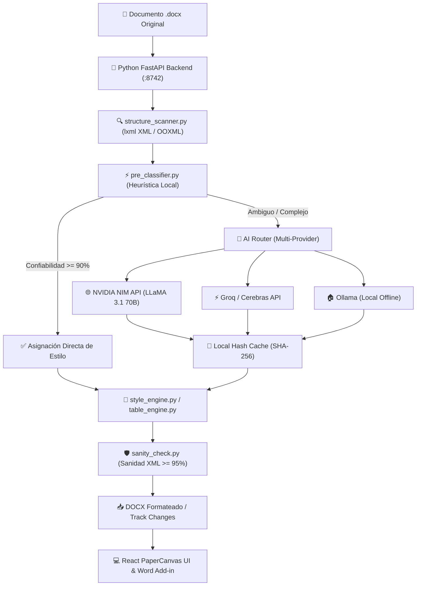

# 📄 WordAPA7 — Formateador Automático e Inteligente a Normas APA 7ª Edición

[](https://python.org)
[](https://fastapi.tiangolo.com)
[](https://reactjs.org)
[](https://typescriptlang.org)
[](https://electronjs.org)
[](https://office.com)
[](LICENSE)

<p align="center">
  <b>Suite académica de alta precisión y complemento nativo para Microsoft Word que transforma documentos universitarios (<code>.docx</code>) a las normas oficiales APA 7.ª Edición, preservando el 100% del contenido original, diagramando portadas de forma indivisible e integrando copilotos de IA proactivos.</b>
</p>

<p align="center">
  <a href="#-instalación-para-usuario-final">📥 Instalación Usuario</a> •
  <a href="#-por-qué-wordapa7-factores-diferenciadores">💡 ¿Por qué WordAPA7?</a> •
  <a href="#-características-principales">✨ Características</a> •
  <a href="#-arquitectura-del-sistema">🏗 Arquitectura</a> •
  <a href="#-instalación-y-ejecución-para-desarrolladores">🚀 Guía Desarrollador</a> •
  <a href="#-seguridad-y-privacidad">🛡️ Seguridad</a>
</p>

---

## 💡 ¿Por qué WordAPA7? (Factores Diferenciadores)

Formatear un documento académico (tesis, monografía, ensayo o artículo) a las normas APA 7ª edición suele ser un proceso tedioso, manual y propenso a errores. Las herramientas tradicionales o plantillas rígidas de Word suelen romper los encabezados institucionales, desordenar tablas o borrar portadas complejas. 

**WordAPA7 resuelve esto con una arquitectura híbrida in-place de grado profesional:**

| Desafío Académico | Formateadores Tradicionales / Plantillas | **WordAPA7 (Nuestra Solución)** |
|---|---|---|
| **Portadas Institucionales Complejas** | Reemplaza o borra la portada por una plantilla genérica, eliminando escudos y logos. | 🛡️ **Preservación In-Place Intacta**: Detecta nodos XML `<wpg:wgp>` y `<wps:txbx>` congelando escudos, logos y cajas de texto universitarias sin partirlas ni alterarlas (`use_original_cover`). |
| **Integración con Microsoft Word** | Obliga a usar herramientas externas sin conexión con Word. | 📌 **Complemento Nativo de Word**: Ofrece una cinta de opciones (Ribbon) en Word y sincronización bidireccional (*Highlight & Jump*) para saltar al párrafo exacto en pantalla. |
| **Modificación de Estructura por IA** | Respuestas de chat pasivas que el usuario debe copiar y pegar a mano. | 🤖 **Copiloto con Action DSL Seguro**: Transforma el documento mediante instrucciones en lenguaje natural ("convierte esto en cita en bloque", "arregla la tabla 2") ejecutadas quirúrgicamente. |
| **Auditoría de Citas y Referencias** | Verificación manual propensa a dejar citas no referenciadas o bibliografía huérfana. | 🔍 **Auditorías Proactivas en Background**: Detecta automáticamente citas no encontradas en la bibliografía, referencias huérfanas, texto pegado sin formato y párrafos generados por IA. |
| **Disponibilidad y Conexión de IA** | Dependen de un único proveedor en la nube que puede caerse o cobrar cuotas altas. | ⚡ **Multi-Proveedor con Failover**: Funciona 100% offline con heurísticas locales súper rápidas o con soporte para NVIDIA NIM, Groq, Cerebras y Ollama (local e ilimitado). |
| **Pérdida de Formato y Control de Revisiones** | Genera un archivo final estático sin historial de cambios. | 📝 **Exportación con Control de Cambios (Track Changes)**: Genera versiones formateadas conservando el historial de revisiones para entregar al tutor o docente. |
| **Instalación en PCs Universitarias** | Requiere derechos de administrador, Python o scripts complejos. | 📦 **Instalador One-Click Portátil**: Se instala sin permisos de administrador en `%LOCALAPPDATA%` registrando automáticamente el complemento en Word. |

---

## ✨ Características Principales

### 📌 1. Complemento Nativo e Integración In-Document para Microsoft Word
- **Integración Ribbon**: Pestaña dedicada **WordAPA7** y grupo en la pestaña **Inicio** dentro de Microsoft Word.
- **Normalización In-Place (1 Clic)**: Formatea directamente el documento abierto en Word (`Word.run`) sin necesidad de exportar ni descargar nuevos archivos.
- **Ver y Resaltar en Word (*Jump & Highlight*)**: Salta visualmente al párrafo exacto dentro del Word de escritorio y lo resalta temporalmente en amarillo para fácil revisión.

### 🎨 2. Lienzo WYSIWYG de Alta Fidelidad (`PaperCanvas.tsx`)
- **Visualización en Papel Blanco Puro**: En modo claro y modo oscuro, el lienzo de trabajo mantiene el color de hoja real (`#ffffff`) con contraste tipográfico nítido (`--paper-ink: #111827`) para evitar la fatiga visual.
- **Paginación Inteligente**: Divide el contenido dinámicamente simulando hojas físicas carta/A4 según los márgenes APA 7 (2.54 cm / 1 pulgada en los 4 lados).
- **Inspección de Nodos**: Panel lateral interactivo para modificar el tipo de elemento (Título 1-5, Párrafo, Lista, Tabla, Figura, Cita en bloque, Referencia).

### 🤖 3. Copiloto Editorial IA y Auditorías Proactivas
- **Editor Conversacional (`LiveChatDrawer.tsx`)**: Asistente inteligente siempre disponible para solicitar modificaciones mediante lenguaje natural.
- **Action DSL Seguro**: Intérprete estructurado que valida sintácticamente las instrucciones antes de aplicarlas a la estructura JSON/Pydantic del documento.
- **Auditorías Proactivas automáticas**:
  1. `runProactiveAudits()`: Cruce automático de citas bibliográficas vs. lista de referencias.
  2. `runProactiveAutoCaptioning()`: Detección e inyección reglamentaria de leyendas (*Tabla N / Figura N*) y notas al pie.
  3. `runProofreadBatch()`: Detección de patrones de escritura generados por IA, inconsistencias ortográficas y texto sin formato.

### 📐 4. Motor de Estilos APA 7.ª Edición Estricto
- **Interlineado y Sangrías**: Normalización global a interlineado **Doble (2.0)**, espacios antes/después en 0pt y sangría de primera línea reglamentaria de **1.27 cm (0.5 in)**.
- **Jerarquía de Títulos (H1 a H5)**:
  - **Nivel 1**: Centrado, Negrita, Título Principal.
  - **Nivel 2**: Alineado a la Izquierda, Negrita.
  - **Nivel 3**: Alineado a la Izquierda, Negrita, Cursiva.
  - **Nivel 4**: Con Sangría 1.27 cm, Negrita, Termina con Punto.
  - **Nivel 5**: Con Sangría 1.27 cm, Negrita, Cursiva, Termina con Punto.
- **Tablas Nativas APA 7**: Eliminación automática de líneas verticales, aplicación de bordes horizontales de 0.5-0.75pt, encabezados en negrita y títulos en cursiva.
- **Sección de Referencias**: Sangría francesa (*Hanging Indent*) de 1.27 cm con ordenamiento alfabético automático por apellido de autor.

### 🛡️ 5. Portadas Estudiante, Profesional y Portada Original
- **Formato Estudiante**: Título, Autor(es), Afiliación Institucional, Curso, Profesor y Fecha de Entrega.
- **Formato Profesional**: Título, Autor(es), Afiliación, Nota del Autor, Encabezado (*Running Head*) de máximo 50 caracteres y Número de Página.
- **Roster Arrastrable (Drag & Drop)**: Libreta de autores e integrantes persistente con autocompletado rápido.

---

## 📥 Instalación para Usuario Final

> 💡 **Sin complicaciones**: No necesitas instalar Python, Node.js ni configurar terminales. Todo viene empaquetado en el instalador `.exe`.

### Paso a paso (3 clics + abrir Word):

1. **Descarga el instalador** `WordAPA7 Setup X.X.X.exe` desde la sección de [Releases de GitHub](https://github.com/WalterSolorzano/ProyectoAPA7/releases).
2. **Ejecuta el archivo** haciendo doble clic sobre el `.exe`.
3. **Aviso SmartScreen de Windows**: Al ser una herramienta académica de código abierto que no utiliza un certificado comercial de pago de miles de dólares, Windows mostrará la ventana azul *"Windows protegió su equipo"*. **Esto es completamente normal e inocuo**:
   - Haz clic en **"Más información"**.
   - Haz clic en **"Ejecutar de todas formas"**.
4. **El instalador realiza el proceso automáticamente**:
   - Instala la aplicación en la carpeta de tu usuario (`%LOCALAPPDATA%\Programs\WordAPA7`).
   - Registra el complemento en Microsoft Word.
   - Añade el acceso rápido *"Convertir a APA 7"* al menú contextual del clic derecho sobre cualquier archivo `.docx`.
   - Abre la aplicación automáticamente al finalizar.
5. **Abre Microsoft Word**: Verás la nueva pestaña **WordAPA7** en la cinta de opciones superior.

> ℹ️ *Si Word ya estaba abierto durante la instalación, simplemente ciérralo y vuelve a abrirlo para que cargue la nueva pestaña.*

---

## 🏗 Arquitectura del Sistema

El sistema utiliza un diseño desacoplado donde el backend en Python expone servicios REST de alto rendimiento y el frontend en React/Electron ofrece la experiencia gráfica responsiva.



### Componentes Clave del Código:

| Módulo | Ruta | Función Principal |
|---|---|---|
| **FastAPI Integration Server** | `python/main.py` | Servidor backend RESTful y lazy-loader COM |
| **Modelos Pydantic** | `python/models.py` | Fuente única de verdad de los datos del documento |
| **Parser XML Profundo** | `python/parsing/xml_deep_parser.py` | Extracción y preservación de nodos OOXML (`<wps:txbx>`, `<wpg:wgp>`) |
| **In-place Engine** | `python/generation/inplace_editor.py` | Modificación de documentos respetando la portada original |
| **Multi-Provider AI Router** | `python/modules/ai_client.py` | Router balanceado con failover entre 10+ proveedores |
| **Copiloto & Action DSL** | `python/modules/ai_document_editor.py` | Intérprete conversacional de comandos estructurales |
| **Auditor Proactivo** | `python/modules/proactive_auditor.py` | Detección de citas huérfanas, patrones de IA y ortografía |
| **Lienzo Interactivo** | `src/components/layout/PaperCanvas.tsx` | Renderizador WYSIWYG en vivo paginado |
| **Zustand Store** | `src/store/useDocStore.ts` | Estado reactivo central y gestor de auditorías |
| **Complemento Word** | `word-addin/` | Manifiesto y scripts de integración para Office JS API |

---

## 🚀 Instalación y Ejecución para Desarrolladores

### Requisitos del Sistema
- **Python**: 3.11 o superior
- **Node.js**: v18.0.0 o superior
- **Git**
- **Microsoft Word**: (Opcional, necesario únicamente para probar el Add-in nativo)

### 1. Clonar el Repositorio
```bash
git clone https://github.com/WalterSolorzano/ProyectoAPA7.git
cd ProyectoAPA7
```

### 2. Configuración Automática (Recomendado)
Ejecuta el script de instalación automática:
```bash
setup.bat
```
Este script realiza las siguientes acciones:
- Valida la versión de Python y Node.js.
- Crea el entorno virtual `venv\` e instala `requirements.txt`.
- Crea el archivo de configuración `.env` desde `.env.example`.
- Instala las dependencias de Node (`npm install`).
- Genera la plantilla base APA 7 y compila el frontend React.

### 3. Iniciar el Entorno de Desarrollo
Para ejecutar la aplicación en modo desarrollo con Hot Module Replacement (HMR):

```bash
# Terminal 1: Servidor Backend FastAPI (Puerto 8742)
python python/main.py

# Terminal 2: Servidor Frontend Vite (Puerto 5173 con proxy a :8742)
npm run dev
```
Accede a la interfaz en tu navegador en: **`http://localhost:5173`** o **`http://localhost:8742`**.

### 4. Pruebas Automatizadas
El proyecto cuenta con un riguroso suite de pruebas unitarias e integración:

```bash
# Pruebas Backend (pytest: 415+ tests)
pytest python/tests/

# Pruebas Frontend (Vitest: 120+ tests)
npm test
```

### 5. Compilar el Instalador de Producción (`.exe`)
Para compilar la aplicación de escritorio completa con backend Python embebido y el complemento de Word:

```powershell
powershell -ExecutionPolicy Bypass -File build-installer.ps1
```
El instalador generado se guardará en `dist-electron-builder/WordAPA7 Setup X.X.X.exe`.

---

## 🛡️ Seguridad y Privacidad

- 🔒 **Procesamiento 100% Local Disponible**: El documento puede ser procesado íntegramente de manera local mediante heurísticas internas o modelos offline (Ollama), garantizando confidencialidad absoluta.
- 🔑 **Gestión Segura de Claves de API**: Las llaves de API ingresadas en la UI se guardan únicamente de forma local en tu máquina (`storage/ai_keys.json`), excluidas de cualquier repositorio o compilación externa.
- ⚡ **Gate de Sanidad XML**: Antes de permitir la descarga de un documento, el motor de sanidad (`sanity_check.py`) verifica la integridad del texto original pre y post procesamiento. Si detecta una pérdida de texto superior al 5%, bloquea automáticamente el resultado para proteger tu información.

---

## 🎨 Paleta de Colores Oficial

WordAPA7 utiliza tokens CSS con la paleta de diseño inspirada en Microsoft Word 365:

| Variable CSS | Hexadecimal | Previsualización | Propósito |
|---|---|---|---|
| `--accent-primary` | `#4F7CFF` | `████████` | Color de marca, selección y acciones principales |
| `--paper-white` | `#FFFFFF` | `████████` | Hoja de trabajo e inspección |
| `--paper-ink` | `#111827` | `████████` | Tinta tipográfica nítida de alto contraste |
| `--canvas-bg` | `#F8F9FA` | `████████` | Fondo exterior del espacio de trabajo |
| `--success` | `#16A34A` | `████████` | Cumplimiento reglamentario APA 7 |
| `--warning` | `#D97706` | `████████` | Advertencias de citas o formato |
| `--danger` | `#DC2626` | `████████` | Inconsistencias o errores críticos |

---

## 📄 Licencia

Este proyecto se distribuye bajo la Licencia [MIT](LICENSE). Siéntete libre de utilizarlo, modificarlo y distribuirlo para fines académicos o comerciales.

<p align="center">
  Hecho con ❤️ para estudiantes, docentes e investigadores universitarios.
</p>
