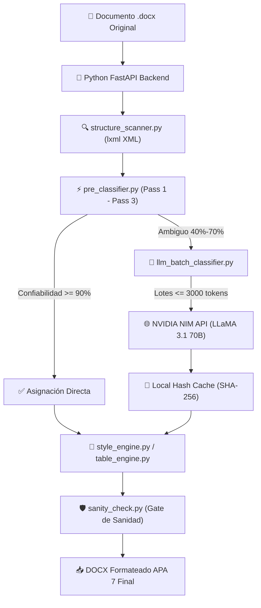

```text
██╗██╗██╗  ██╗██████╗  ██████╗  ██████╗  █████╗ ╚██╗██╗
██║██║██║  ██║██╔══██╗██╔═══██╗██╔════╝ ██╔══██╗ ╚██╗██╗
██║██║███████║██████╔╝██║   ██║██║  ███╗███████║  ██║██║
██║██║██╔══██║██╔═══╝ ██║   ██║██║   ██║██╔══██║  ██║██║
██║██║██║  ██║██║     ╚██████╔╝╚██████╔╝██║  ██║██╔╝██║
╚═╝╚═╝╚═╝  ╚═╝╚═╝      ╚═════╝  ╚═════╝ ╚═╝  ╚═╝╚═╝ ╚═╝
              W O R D   A P A   7   v 1 . 0
```

<div align="center">

# 📄 WordAPA7 — Formateador Automático Académico a APA 7ª Edición

[](https://python.org)
[](https://fastapi.tiangolo.com)
[](https://reactjs.org)
[](https://typescriptlang.org)
[](https://build.nvidia.com)
[](LICENSE)

<p align="center">
  <b>Plataforma de alta precisión para transformar documentos universitarios y académicos (<code>.docx</code>) a las normas oficiales APA 7ª Edición manteniendo el 100% del contenido original, diagramación de portada in-place y tablas nativas.</b>
</p>

[✨ Características](#-características-principales) • [🏗 Arquitectura](#-arquitectura-del-sistema) • [🚀 Instalación](#-instalación-y-ejecución) • [🛡️ Seguridad](#-seguridad-y-variables-de-entorno)

---

</div>

## 🎨 Paleta de Colores Hexadecimal (#HEX)

| Componente UI | Código Hexadecimal | Previsualización |
|---|---|---|
| **Word Deep Blue** | `#1B365D` | `████████` |
| **Accent Emerald** | `#10B981` | `████████` |
| **Cyber Indigo** | `#6366F1` | `████████` |
| **NVIDIA Green** | `#76B900` | `████████` |
| **Warning Amber** | `#F59E0B` | `████████` |
| **Dark Canvas** | `#0F172A` | `████████` |

---

## ✨ Características Principales

### 🛡️ Preservación In-Place de Portadas Universitarias
- **Modificación Quirúrgica XML**: Mantiene intactos agrupamientos de formas `<wpg:wgp>`, cajas de texto `<wps:txbx>`, logos institucionales y encabezados universitarios sin sobreescribirlos ni borrarlos.
- **Roster Arrastrable (Drag & Drop)**: Libreta de integrantes persistente en `localStorage` con autocompletado rápido de autores, carnet, tutor y fecha.

### 📐 Motor de Estilos APA 7º Estricto
- **Normalización Global de Interlineado**: Aplica interlineado **Doble 2.0 (`w:line="480"`)** y `0pt` de espacio antes/después en el 100% de los párrafos del cuerpo.
- **Jerarquía de Títulos (H1 a H5)**: Todos los niveles normalizados a **12pt** (tamaño único del cuerpo). H1 centrado en negrita (`<w:jc w:val="center"/>`), H2/H3 a la izquierda.
- **Tablas Nativas APA 7**: Cero bordes verticales, bordes horizontales de 0.75pt, primera fila de encabezados en negrita obligatoria y título en cursiva.

### 🤖 Clasificación Híbrida Inteligente (NVIDIA NIM)
- **Score Multi-Criterio + Heurística Local**: Resuelve el 85%+ de párrafos instantáneamente sin consumir API Keys.
- **Cola de Lotes NVIDIA NIM (LLaMA 3.1 70B Instruct)**: Procesa secuencialmente en lotes seguros (máx 3,000 tokens) los elementos ambiguos (`needs_review = True`) con reintentos automáticos y caché local por hash SHA-256.
- **Panel de Diagnóstico en Tiempo Real**: Badge interactivo y modal emergente con métricas de latencia, tokens y códigos de respuesta HTTP.

---

## 🏗 Arquitectura del Sistema



---

## 🚀 Instalación y Ejecución

### Requisitos Previos
- **Python**: 3.11 o superior
- **Node.js**: v18.0.0 o superior
- **Git**

### 1. Clonar el Repositorio
```bash
git clone https://github.com/tu-usuario/wordapa7.git
cd wordapa7
```

### 2. Setup Automático (recomendado)
```bash
setup.bat
```

`setup.bat` hace todo en un solo paso:
- Verifica Python 3.11+ y Node.js 18+ en el PATH.
- Crea el entorno virtual `venv\` e instala `requirements.txt` en él.
- Copia `.env.example` → `.env` (solo si no existe) y restringe su acceso al usuario actual.
- `npm install` + genera la plantilla APA7 + `npm run build`.

### 3. Iniciar la Aplicación
```bash
start.bat
```
(o `powershell -ExecutionPolicy Bypass -File start.ps1`). El arranque usa
`venv\Scripts\python.exe` si existe. Abre en tu navegador: **`http://localhost:8742`**

### 4. Setup Manual (alternativa)
```bash
# Entorno virtual + dependencias
python -m venv venv
venv\Scripts\pip install -r requirements.txt
npm install
venv\Scripts\python python\create_template.py
npm run build
```

### 5. Configurar Variables de Entorno
Copia el archivo `.env.example` a `.env` si `setup.bat` no lo hizo:
```bash
cp .env.example .env
```
Edita `.env` con tu API Key opcional de NVIDIA NIM:
```env
NVIDIA_API_KEY=nvapi-TU_CLAVE_AQUI
NVIDIA_NIM_MODEL=meta/llama-3.1-70b-instruct
```

## 🔐 Seguridad de Claves de API

- **No se empaquetan claves en el instalador.** `electron-builder.yml` usa
  empaquetado *whitelist*: solo `dist/**`, `dist-electron/**` y
  `dist-python/**` (bundle PyInstaller que incluye únicamente
  `python/assets/`). `.env`, `.env.example`, `storage/` y `requirements.txt`
  NUNCA se incluyen en `electron:build`.
- **`.env.example` solo contiene placeholders.** `setup.bat` verifica que no
  haya claves reales (patrón `nvapi-`/`sk-`/`gsk_`/`csk-`) y aborta si las
  encuentra, para evitar distribuir una clave real por accidente.
- **`.env` está en `.gitignore`** y `setup.bat` le aplica ACL de Windows para
  restringirlo al usuario actual. Nunca lo subas a git ni lo compartas.
- Las claves que escribes en la UI se conservan en `storage/ai_keys.json`
  (carpeta local, también gitignore) y se restauran en `os.environ` al iniciar.
  Es cifrado en reposo no aplicado: las claves están en texto plano en tu disco
  local, como es típico en apps de escritorio. No compartas la carpeta del
  proyecto ni hagas backups que la incluyan.

### Claves embebidas en el instalador (ofuscadas)

Para que la IA funcione **sin configuración** en el instalador, las claves de
los 10 proveedores se empaquetan dentro del instalador de forma **ofuscada**
(XOR + base64 con semilla compartida), generadas por `python/embed_payload.py`
desde tu `.env` local en cada `npm run build:backend`:

1. El build lee tu `.env` (local, gitignoreado) y escribe
   `python/_embedded_payload.json` (gitignoreado, nunca se sube a git).
2. PyInstaller lo incluye como data en `_internal/_embedded_payload.json`.
3. En runtime, `python/embedded_secrets.py` lo decodifica y lo inyecta en
   `os.environ` **solo si la variable aún no está definida** (prioridad:
   entorno del launcher > claves del usuario en `ai_keys.json` > embebidas).

**Verificado**: ningún fragmento de 10+ caracteres de las claves reales aparece
en el instalador (`WordAPA7 Setup *.exe`), `app.asar` ni el backend empaquetado.

> ⚠️ **Límite honesto**: esto es *ofuscación*, no cifrado real. Cualquier
> proceso que pueda *usar* la clave también puede *extraerla* (depurar la app o
> volcar su memoria/entorno). Solo eleva la barrera contra extracción casual
> (strings, grep, escaneo binario). **No distribuyas este instalador
> públicamente**: todos los usuarios compartirían las mismas claves y cuota, y
> los proveedores pueden bloquearlas. Para distribución pública, la solución
> real es un proxy server-side (las claves nunca tocan el cliente).

---

## 🧪 Pruebas Automatizadas

El proyecto cuenta con un suite automatizado de 146 pruebas unitarias e integración:

```bash
# Ejecutar suite de pruebas pytest
pytest python/tests

# Validar build de producción frontend React
npm run build
```

---

## 🛡️ Seguridad y Buenas Prácticas

- 🔒 **Sin Fuga de Credenciales**: `.gitignore` excluye strictly `.env`, archivos de sesión en `storage/` y archivos `.docx` temporales.
- ⚡ **Gate de Sanidad**: El pipeline mide la retención de caracteres pre/post exportación y bloquea descargas si se detecta una pérdida superior al 5%.

---

## 📄 Licencia

Este proyecto está bajo la Licencia [MIT](LICENSE).
